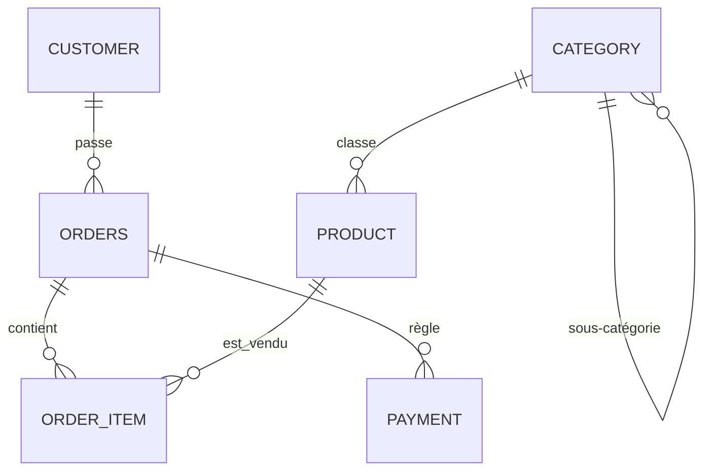

# Projet 07 — Base de données e-commerce (PostgreSQL, 3NF)

[](https://github.com/valentinratigniet-byte/projet-07-base-ecommerce/actions/workflows/ci.yml)

> **Le socle du portfolio.** Concevoir une base relationnelle propre à partir d'un
> besoin métier, la peupler avec un volume réaliste, et **prouver** — chiffres à
> l'appui — qu'elle garantit l'intégrité des données et qu'un index bien placé
> accélère les requêtes.
>
> Cette base sert de source aux projets 08 (SQL analytique), 09 (dashboard
> Power BI), 10 (pipeline ELT) et 11 (gouvernance).

## 🎯 Problème métier

Avant d'analyser des ventes, il faut une base **bien modélisée** : sans schéma
normalisé ni contraintes, les données se dégradent (doublons, prix négatifs,
statuts incohérents) et toute analyse en aval devient fausse. Ce projet part du
domaine e-commerce (clients, catalogue, commandes, paiements) et le traduit en un
schéma PostgreSQL en 3NF, contraint et indexé.

## 🗂️ Modèle de données

Diagramme complet et justification de la normalisation : **[docs/mcd.md](docs/mcd.md)**.



6 tables · clés primaires/étrangères · clé composite (`order_item`) · FK
auto-référencée (`category`) · contraintes `UNIQUE` / `CHECK` sur chaque règle de
gestion.

## 📊 Résultats mesurés

Base peuplée avec **Faker** (données reproductibles, seed fixe) :

| Table | Lignes |
|---|---:|
| customer | 5 000 |
| product | 2 000 |
| orders | 40 000 |
| order_item | 119 788 |
| payment | 34 302 |

### 1. L'intégrité est garantie (5/5 tests passent)

`sql/05_integrity_tests.sql` tente 5 insertions illégales — **toutes rejetées** :
prix négatif, statut inconnu, email en double, FK produit inexistant, quantité 0.

### 2. Un index accélère la requête clé de **~26×**

Requête : chiffre d'affaires et unités vendues pour un produit donné, sur
119 788 lignes.

| | Plan d'exécution | Temps | Coût estimé |
|---|---|---:|---:|
| **Sans index** | `Seq Scan` | **9,67 ms** | 2285 |
| **Avec index** `idx_order_item_product` | `Bitmap Index Scan` | **0,36 ms** | 193 |

Mesuré via `EXPLAIN (ANALYZE, BUFFERS)` — voir `sql/04_explain_demo.sql`.

## 🚀 Reproduire en 4 commandes

Prérequis : **Docker** et **Python 3.9+** (aucune installation de PostgreSQL
nécessaire).

```bash
docker compose up -d                              # Postgres + schéma auto-chargé (port 5433)
pip install -r seed/requirements.txt
python seed/seed.py                               # peuple la base avec Faker
docker exec -i p07_ecommerce_db psql -U portfolio -d ecommerce < sql/05_integrity_tests.sql
```

Démo de l'index (avant / après) :

```bash
docker exec -i p07_ecommerce_db psql -U portfolio -d ecommerce < sql/04_explain_demo.sql
docker exec -i p07_ecommerce_db psql -U portfolio -d ecommerce < sql/03_indexes.sql
docker exec -i p07_ecommerce_db psql -U portfolio -d ecommerce < sql/04_explain_demo.sql
```

Connexion depuis un client (DBeaver, psql…) : `localhost:5433`, base `ecommerce`,
user/mdp `portfolio` / `portfolio`.

## 🗃️ Structure du repo

```
projet-07-base-ecommerce/
├── README.md               ← ce fichier
├── docker-compose.yml      ← PostgreSQL 16 en conteneur (port 5433)
├── sql/
│   ├── 01_schema.sql       ← DDL 3NF (chargé au démarrage du conteneur)
│   ├── 03_indexes.sql      ← index de performance
│   ├── 04_explain_demo.sql ← démo EXPLAIN ANALYZE avant/après
│   └── 05_integrity_tests.sql ← preuves que les contraintes rejettent l'invalide
├── seed/
│   ├── seed.py             ← peuplement Faker (reproductible)
│   └── requirements.txt
└── docs/
    └── mcd.md              ← diagramme entité-association + choix de normalisation
```

## 🧠 Choix de conception notables

- **`unit_price` sur `order_item`** = prix figé à l'achat, distinct de
  `product.price` (le catalogue peut évoluer sans réécrire l'historique).
- **`payment` séparé de `orders`** : une commande peut avoir 0..n règlements.
- **`category` auto-référencée** : hiérarchie de catégories sans table redondante.
- **Port 5433** : évite le conflit avec un PostgreSQL déjà installé sur la machine.

---

*Projet 07 du [Portfolio Data](https://github.com/valentinratigniet-byte). Prochaine brique : Projet 08 — bibliothèque
SQL analytique, qui interroge cette base.*
