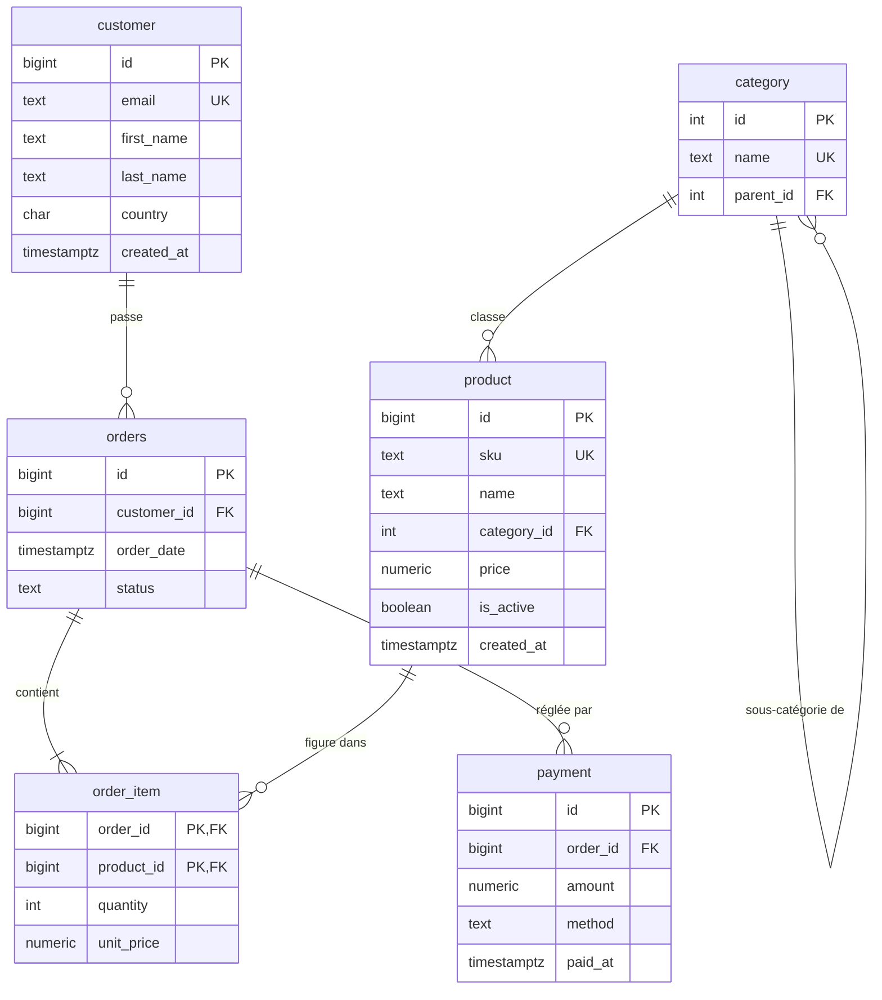

# Modèle de données — Base e-commerce (3NF)

Diagramme entité-association (rendu directement sur GitHub via Mermaid).

## Choix de normalisation (jusqu'en 3NF)

- **1NF** — aucune valeur multivaluée : les produits d'une commande vivent dans
  `order_item` (une ligne par produit), pas dans une colonne « liste ».
- **2NF** — `order_item` a une clé composite `(order_id, product_id)` ; `quantity`
  et `unit_price` dépendent de la clé **entière**, pas d'une partie seulement.
- **3NF** — aucune dépendance transitive : le nom d'une catégorie n'est stocké
  qu'une fois dans `category` ; `product` n'en garde que la **clé étrangère**.
- **`unit_price` dupliqué depuis `product.price` ?** Non : c'est le prix **au
  moment de l'achat**, une donnée propre à la ligne. Le prix catalogue peut
  changer sans réécrire l'historique des ventes.
- **`payment` séparé de `orders`** — une commande peut avoir 0, 1 ou plusieurs
  règlements (acompte, remboursement partiel). Fusionner violerait la 3NF.
